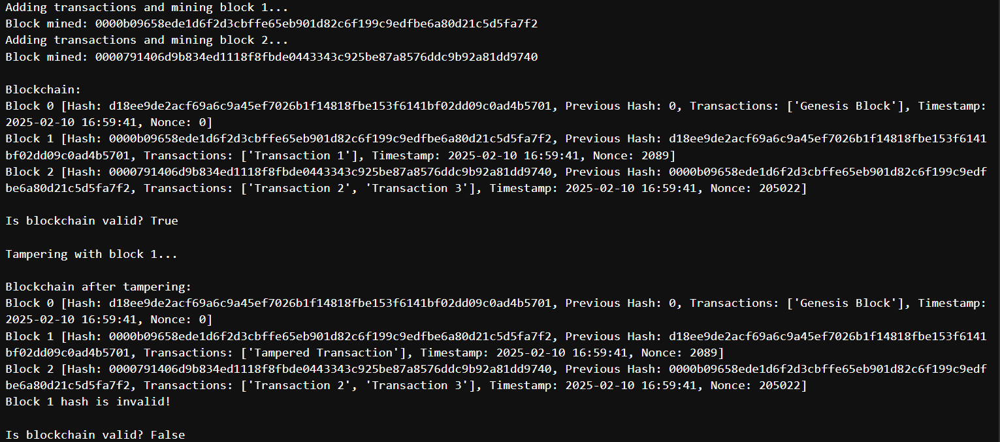

# Simple-Blockchain-Simulation-Assignment-Task-
## Installation 
1. Clone the repository 
```bash
git clone https://github.com/rohitd2103/Simple-Blockchain-Simulation-Assignment-Task-
cd Simple-Blockchain-Simulation-Assignment-Task-
```

2. Run the Blockchain Script:
```bash
python blockchain.py
```

## Features and Functionality
Block Structure:

  1. Each block contains:
  Each block contains:
  Block number (index),
  Timestamp of block creation,
  List of transactions,
  Hash of the previous block,
  Current block hash,
  Nonce (for proof-of-work)

  2. Uses SHA-256 hashing algorithm to generate the block’s hash based on its data and the previous block’s hash.
  3. Validates the blockchain by checking: Each block’s hash is correct, each block correctly references the hash of the previous block.
  4. Demonstrates tampering detection by modifying a block’s transactions and validating the chain’s integrity.
  5. Implements a basic proof-of-work mechanism to make block creation computationally intensive.
  6. The mine_block method ensures the block’s hash meets a difficulty target (e.g., a certain number of leading zeros).

## Output 


